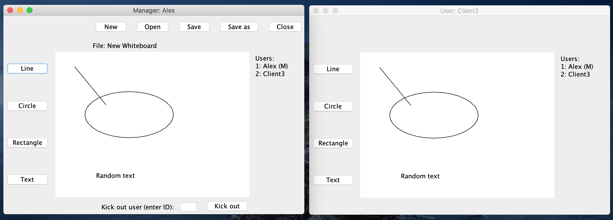
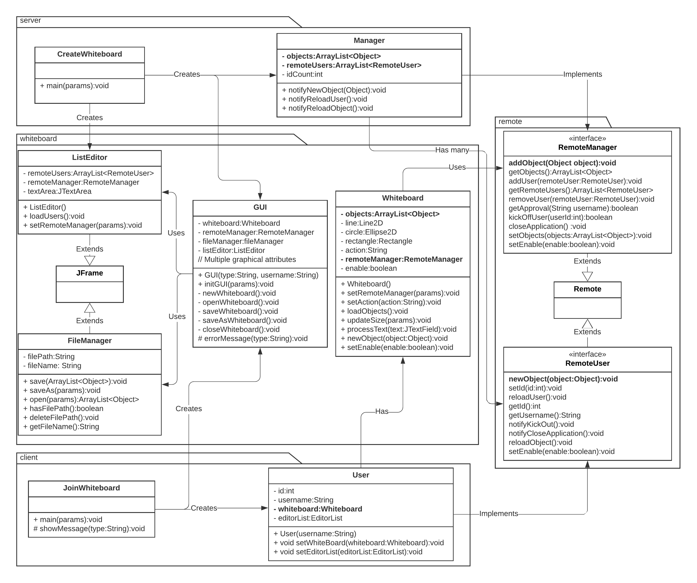

## Shared Whiteboard
A Java-based shared whiteboard application built with Java RMI. 

## Context
- This application was part of the subject Distributed Systems at University of Melbourne.
- It was a personal assessment (no group project).

## Build with
- IntelliJ IDEA
- Java RMI (Java Remote Method Invocation)

## General characteristics:
- A shared whiteboard (real-time operation). The effect of the operations of one user is visible to all the rest.
- Operating through a GUI when the users  draw shapes (line, circle, rectangle) and write text.
- The usernames of the participants are visible for all the users.
- When a user is connecting to the whiteboard, he must to ask for accessing to the
- The manager is able to kick out a certain user.
- A file menu (New, Open, Save, Save As, Close) is provided for the manager.

## UML Class Diagram

